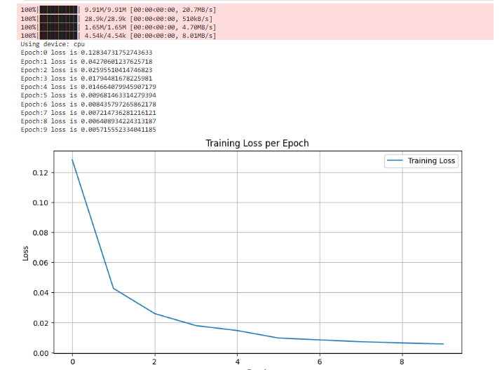
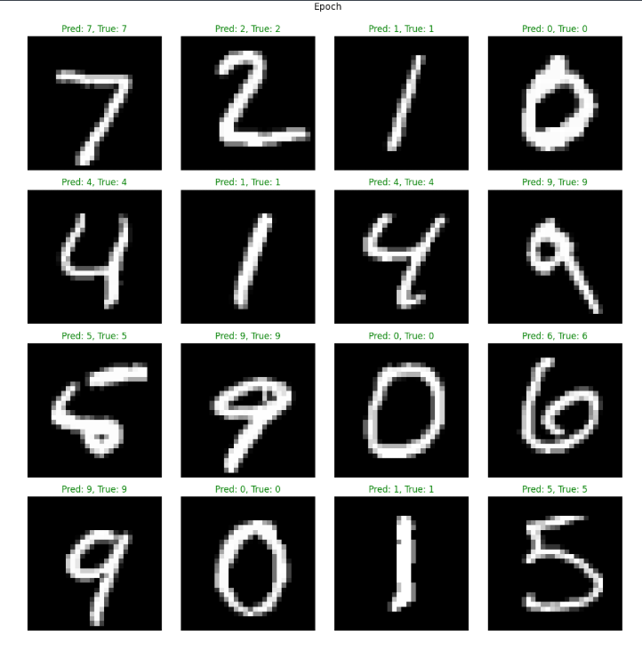

# PyTorch MNIST Classifier: A Deep Learning Implementation


This repository contains a complete implementation of a Convolutional Neural Network (CNN) designed to classify handwritten digits from the MNIST dataset. The project demonstrates a full machine learning workflow, from data loading and model training to evaluation and visualization, built entirely in Python using the PyTorch framework.

---

## Key Features & Purpose

This project serves as a practical demonstration of end-to-end application development, requiring systematic problem-solving and management of a multi-stage technical pipeline. The core objective was to build a reliable system that could accurately process and classify visual data.

* **End-to-End System:** Manages the entire process from data ingestion and processing to model training, evaluation, and visual reporting.
* **Accurate Classification:** Achieves high accuracy on the MNIST test set, showcasing a robust and effective model architecture.
* **Data Visualization:** Presents clear and informative visualizations of model performance, including training loss and prediction results.
* **Reproducible Environment:** The project is fully documented and includes a `requirements.txt` file for easy replication and setup.

---

## Demonstration of Results

The model was trained for 10 epochs, demonstrating a clear and consistent decrease in training loss, which indicates successful learning.




#### **Prediction Results on Test Data**
The model's performance on unseen data from the test set. Predictions are labeled, with green indicating a correct classification and red indicating an error.



---

## Technology Stack

| Component         | Technology                               |
| ----------------- | ---------------------------------------- |
| **ML Framework** | PyTorch                                  |
| **Data Handling** | NumPy, TorchVision                       |
| **Visualization** | Matplotlib                               |
| **Environment** | Python 3.11                              |

---

## Operational & Systems Insight


* **Hardware & Driver Management:** The training process was accelerated using an NVIDIA GPU, which required the correct setup and management of CUDA drivers and PyTorch environments to ensure hardware compatibility and performance.
* **Troubleshooting:** The initial model had a channel mismatch error that required systematic debugging and analysis of the data flow through the network layers to resolve. This mirrors the diagnostic process used in IT troubleshooting.
* **End-to-End Project Management:** This project was managed from conception to completion, demonstrating the ability to handle a full technical lifecycle and deliver a functional, well-documented application.


---

## Setup & Usage

To run this project locally, please follow these steps.

1.  **Clone the repository:**
    ```bash
    git clone [https://github.com/DanteVeil/NeuralNet.git](https://github.com/DanteVeil/NeuralNet.git)
    cd NeuralNet
    ```

2.  **Create and activate a virtual environment:**
    ```bash
    # For Windows
    python -m venv venv
    .\venv\Scripts\activate
    ```

3.  **Install the required dependencies:**
    ```bash
    pip install -r requirements.txt
    ```

4.  **Run the main script:**
    ```bash
    python TorchNeuralNet.py

    ```

